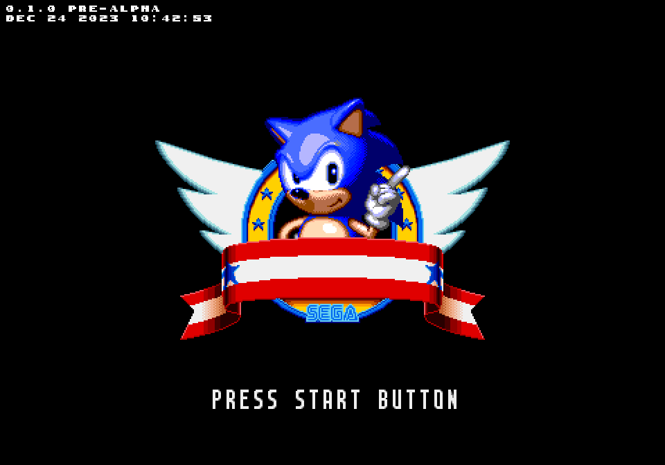
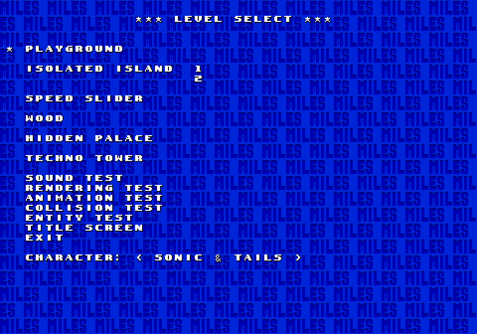
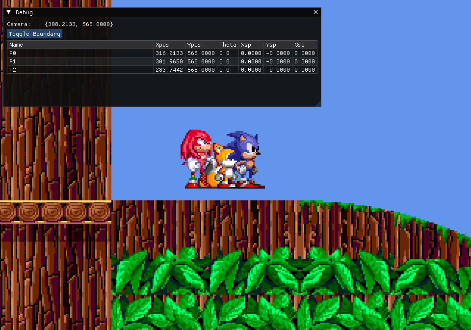
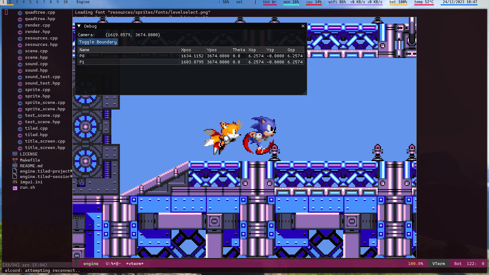
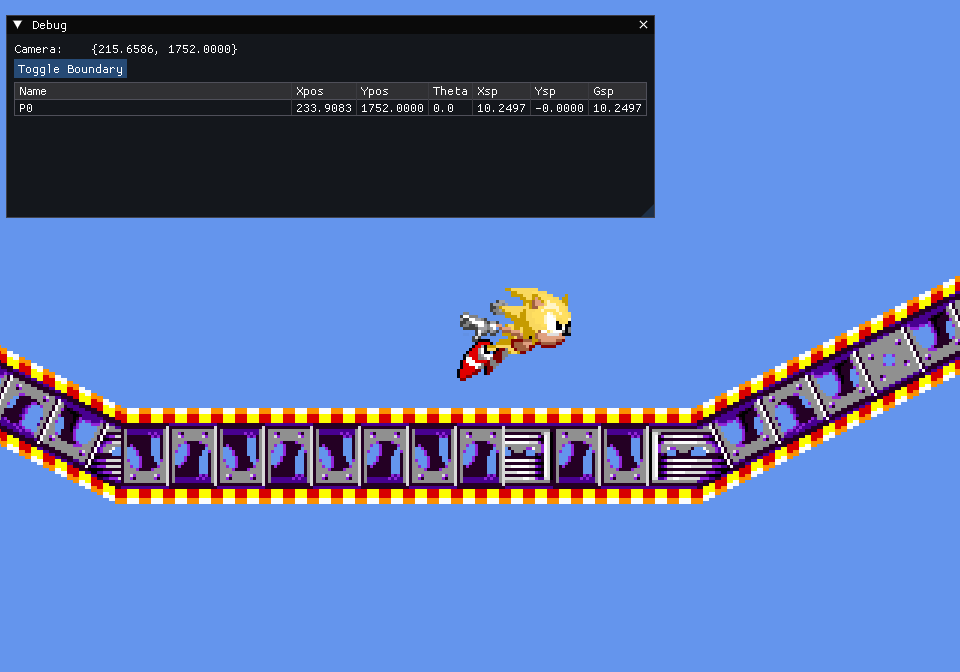

# 360° 2D Engine

This is a 360° 2D Platformer engine, heavily inspired by Sonic The Hedgehog. It has no name yet.

This is one of my many attempts to emulate Classic Sonic's movements from scratch using a custom-built game engine. This time, I'm trying to make the 2D platformer movement as a focus, not doing anything necessarily generic.

This is purely a hobby project which I started after many (many!) attempts at making 2D games from scratch. This time, I'm trying to use the simplest tools to build something more robust and yet explore new things, such as:

- A more modern approach at 2D rendering, by using OpenGL ES 3.2;
- Dynamic assets, such as levels, maps, tilesets, music and even character animation;
- Extensible usage of an Entity Component System (ECS) for handling objects, behaviour, etc, wherever possible;
- A simple asset manager that allows me to handle assets and not worry about dangling pointers.

I will add more info here as the project goes on.

## Dependencies

Libraries and frameworks:

- GLFW
- OpenGL ES 3.2
- Toml++
- RapidXML
- dear imgui 3.2.7 (included)
- Flecs 1.89.9 (included)
- OpenAL v1.23.1
- OGG v1.3.5
- Vorbis v1.3.7

Some tools I generally use:

- GCC with C11, C99 and C++20 support
- GNU Make
- CMake 3.20 or above
- Tiled 1.10.2 or above (for level maps, tiles, collision)
- [SpriteSheetPacker](http://amakaseev.github.io/sprite-sheet-packer/) (for organizing level chunks)
- GIMP (for editing any image stuff)
- Audacity (for editing and figuring out the looping points of audio files)

# Building

1. Create a `build/` directory on project root.
2. `cd` into `build/`, then run `cmake ..`. This will generate a Makefile.
3. Run `make`. This will produce a binary called `game`.

Notice that, if you're going to run the game, you need to run from the same directory where the `resources/` directory exists, otherwise no game assets will be found. Use the `run.sh` script to facilitate this process.

# License

First and foremost: **I do not own anything that directly relates to Sonic The Hedgehog**, which is an IP by SEGA/SONICTEAM. Everything related to Sonic here is being used mostly as a reference and also because I'm a big fan of Sonic The Hedgehog since I was young.

All code here is distributed under the MIT License. For more information, see the LICENSE file.

# More screenshots

## v0.1.0 pre-alpha

_Please notice that even though the levels are rendered, there is no collision in this version. ;)_

